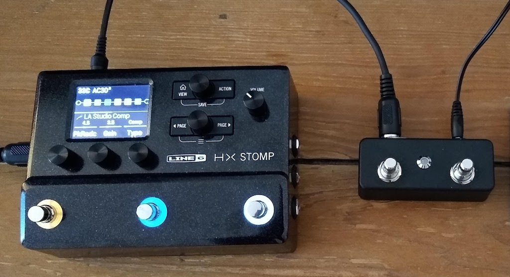
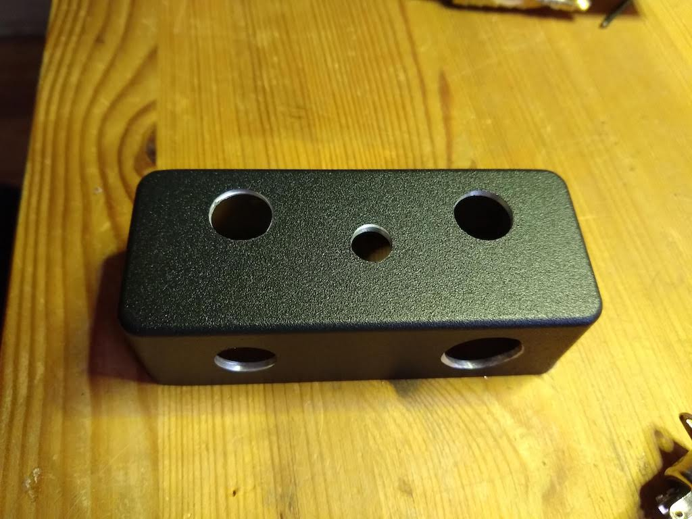
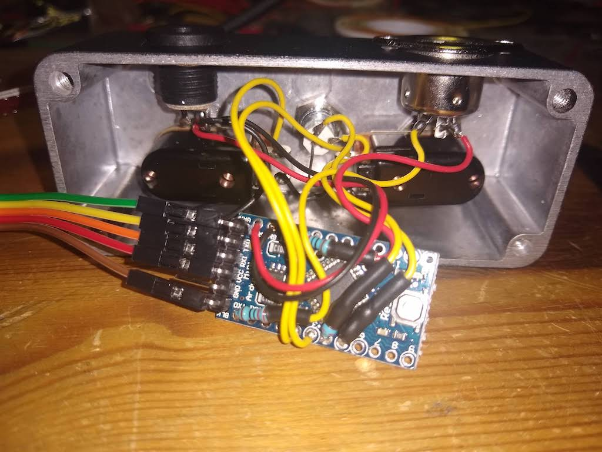

# MIDI Muppet HX

This is a small Arduino based two button MIDI foot switch for the Helix HX Stomp. It is more flexible and more powerful than the "normal" foot switches connected via TRS cable and as a bonus you can still use an expression pedal hooked up to your HX Stomp.

The MIDI Muppet HX can
- scroll through presets (normal mode)
- scroll through snapshots (snapshot mode)
- act as FS4/FS5 (fs mode)
- bring up the tuner

To cycle through modes, press and hold the right (up) switch. To toggle the tuner, press and hold the left (dn) switch.

    NORMAL Mode:    up/dn switches prog patches
                    long press dn: TUNER
                    long press up: SNAPSHOT
                    up + dn: toggle FS4/FS5 and NORMAL mode
    TUNER Mode:     up or dn back to prev Mode
    SNAPSHOT Mode:  up/dn switches snapshot
                    long press dn: TUNER
                    long press up: FS mode
    FS Mode:        up/dn emulate FS4/FS5
                    long press up: TUNER
                    long press dn: back to NORMAL mode

# Building MIDI Muppet HX
Parts are around 20€:
- Stomp case: e.g. Hammond 1590A
- 2 momentary foot switches
- Arduino Pro Mini with programming headers populated
- MIDI/DIN Socket
- 2,1 mm power Socket
- bicolor LED (red/green, common cathode)
- FTDI serial adaptor (for programming)

A little bit of drilling, soldering and hot snot will be required.

# Wiring
- Arduino D2, D3: Button Up/Down to ground
- Arduino D4, D5: via 220R resistor to LED green/red anode, cathode to ground
- Arduino TX pin: via 220R resistor to MIDI pin 5 (data line)
- Arduino 5V/VCC pin: via 220R resistor to MIDI pin 4 (voltage reference line)
- Arduino RAW pin: 9V from power socket
- Arduino GNC pin: GND from power socket

I put a little bit of capton tape on backside of a foot switch and on the the inside of the case for isolation and fixated the Arduino PCB with a little bit of hot snot.

# The Code
The code requires the OneButton library to be installed.

# Programming
Disconnect external power supply first! The FTDI adaptor will provide power.

Hook up the FTDI adaptor to the Arduino board, select "Arduino Pro or Pro Mini" in your Arduino IDE, load the code, compile and upload.

The RED LED will flash rapidly on boot. Congratulations.

